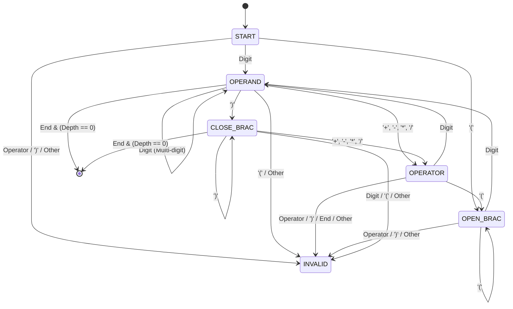

# Compiler Lab Theory Notes (`8-theory.md`)

This document collects and explains theoretical and practical principles for **validating mathematical expressions** in compiler design. It details the syntactic grammar rules, pushdown automata models, state machines, algorithmic invariants, and diagnostic analysis of common implementation errors in C, C++, and Python.

## Table of Contents
1. [Compiler Pipeline & Syntactic Grammar](#1-compiler-pipeline--syntactic-grammar)
   - [Compiler Phase Mapping](#compiler-phase-mapping)
   - [Context-Free Grammar (CFG) for Infix Arithmetic](#context-free-grammar-cfg-for-infix-arithmetic)
   - [Language Invariants & Structural Rules](#language-invariants--structural-rules)
   - [Asymptotic Complexity](#asymptotic-complexity)
2. [Automata & State Machine Models](#2-automata--state-machine-models)
   - [State Transition Diagram (Mermaid)](#state-transition-diagram-mermaid)
   - [State Transition Matrix](#state-transition-matrix)
   - [Pushdown Automaton (PDA) Intuition for Brackets](#pushdown-automaton-pda-intuition-for-brackets)
3. [Deep Diagnostic Analysis of `8.1_alt.cpp`](#3-deep-diagnostic-analysis-of-81_altcpp)
   - [Error 1: Parameter Inversion in `getline`](#error-1-parameter-inversion-in-getline)
   - [Error 2: Type Incompatibility in Token Functions (`char` vs `std::string`)](#error-2-type-incompatibility-in-token-functions-char-vs-stdstring)
   - [Error 3: Accidental Assignment in Conditional (`=` vs `==`)](#error-3-accidental-assignment-in-conditional--vs-)
   - [Error 4: Buffer Read Out-of-Bounds (`exp[i + 1]`)](#error-4-buffer-read-out-of-bounds-expi--1)
   - [Error 5: Flawed Operator Follow-Set (`2*(3+4)` Rejection)](#error-5-flawed-operator-follow-set-234-rejection)
   - [Error 6: Leading and Trailing Binary Operators](#error-6-leading-and-trailing-binary-operators)
   - [Error 7: Flawed Parenthesis Balancing Counter](#error-7-flawed-parenthesis-balancing-counter)
4. [Polyglot Comparative Implementations](#4-polyglot-comparative-implementations)
   - [Standard Comparison Table](#standard-comparison-table)
   - [C++ Canonical Implementation](#c-canonical-implementation)
   - [C Implementation (Safe Memory & Buffer Model)](#c-implementation-safe-memory--buffer-model)
   - [Python 3 Implementation](#python-3-implementation)
5. [Edge Cases, Pitfalls & Test Matrix](#5-edge-cases-pitfalls--test-matrix)
   - [Comprehensive Test Case Suite](#comprehensive-test-case-suite)
   - [Memory & Delimiter Safety Recommendations](#memory--delimiter-safety-recommendations)
6. [DSA Stack-Based Expression Validator (Pushdown Automata)](#6-dsa-stack-based-expression-validator-pushdown-automata)
   - [Theoretical Motivation: Beyond Scalar Depth Counters](#theoretical-motivation-beyond-scalar-depth-counters)
   - [Multi-Bracket Dyck Language Properties](#multi-bracket-dyck-language-properties)
   - [C++ Stack Implementation Architecture (`8.1_stack.cpp`)](#c-stack-implementation-architecture-81_stackcpp)
   - [Comparative Matrix: Scalar Counter vs Stack Model](#comparative-matrix-scalar-counter-vs-stack-model)

---

## 1. Compiler Pipeline & Syntactic Grammar

### Compiler Phase Mapping
Validating an arithmetic expression spans two fundamental phases of the compiler front-end:
1. **Lexical Analysis (Scanning)**:
   - Partitions the raw character stream into tokens:
     - `NUM` / `IDENTIFIER`: `[0-9]+` or `[a-zA-Z_][a-zA-Z0-9_]*`
     - `OP`: `+`, `-`, `*`, `/`
     - `LPAREN`: `(`
     - `RPAREN`: `)`
2. **Syntax Analysis (Parsing)**:
   - Verifies whether the sequence of tokens forms a valid sentence generated by the language's **Context-Free Grammar (CFG)**.
   - Enforces operator precedence, associativity, and matching paired delimiters (parentheses).

```
Raw Input String ────► [ Lexer / Scanner ] ────► Token Stream ────► [ Syntax Validator / Parser ] ────► VALID / INVALID
```

### Context-Free Grammar (CFG) for Infix Arithmetic
Standard infix mathematical expressions with binary operators and parentheses are generated by the following non-ambiguous CFG:

$$
\begin{aligned}
E &\to E + T \mid E - T \mid T \\
T &\to T * F \mid T / F \mid F \\
F &\to ( E ) \mid \text{id} \mid \text{num}
\end{aligned}
$$

In Backus-Naur Form (BNF):
```text
<Expression> ::= <Term> ( ( "+" | "-" ) <Term> )*
<Term>       ::= <Factor> ( ( "*" | "/" ) <Factor> )*
<Factor>     ::= "(" <Expression> ")" | <Number> | <Identifier>
<Number>     ::= [0-9]+
```

### Language Invariants & Structural Rules
For an infix expression to be syntactically valid without unary operators:
1. **Boundary Constraints**:
   - An expression cannot start with a binary operator (`*`, `/`, `+`, `-`).
   - An expression cannot end with a binary operator.
2. **Adjacency / Follow-Set Constraints**:
   - **Operator (`+`, `-`, `*`, `/`)**: Must be followed by a `Number` or an opening bracket `(`. It cannot be followed by another operator or a closing bracket `)`.
   - **Opening Bracket (`(`)**: Must be followed by a `Number` or nested `(`. It cannot be immediately closed (`()`) or followed by an operator (`(*5)`).
   - **Closing Bracket (`)`)**: Must be followed by an operator, another closing bracket `)`, or the end of the expression. It cannot be followed directly by a number without an explicit operator (e.g., `(2+3)4` is invalid in strict grammar).
   - **Number (`[0-9]`)**: In single-character validation, adjacent digits combine into multi-digit numbers. A number cannot be directly followed by `(` (e.g. `4(2+3)` is invalid without `*`).
3. **Parenthesis Well-Formedness (Dyck Language)**:
   - At every index $k \in [0, N-1]$, $\text{count}(\text{'('}) \ge \text{count}(\text{')'})$.
   - At end-of-string, $\text{count}(\text{'('}) == \text{count}(\text{')'})$.

### Asymptotic Complexity
- **Time Complexity**: $\mathcal{O}(N)$, where $N$ is the length of the expression string. A single linear scan inspects current and immediate lookahead characters in constant $\mathcal{O}(1)$ time.
- **Space Complexity**:
  - $\mathcal{O}(1)$ auxiliary space when using a bracket counter for single-style parentheses `()`.
  - $\mathcal{O}(N)$ auxiliary space when using an explicit `std::stack<char>` to support multiple bracket types (`()`, `[]`, `{}`).

---

## 2. Automata & State Machine Models

### State Transition Diagram (Mermaid)
A simplified deterministic state machine tracks the syntax state as tokens are consumed:



### State Transition Matrix
The table below specifies legal transitions from the current token category to the next lookahead token:

| Current Token | Next Token: Digit | Next Token: Operator | Next Token: `(` | Next Token: `)` | Next Token: End-of-Stream |
| :--- | :---: | :---: | :---: | :---: | :---: |
| **Start of Expression** | Valid | **Invalid** | Valid | **Invalid** | **Invalid** (Empty) |
| **Digit / Operand** | Valid (Multi-digit) | Valid | **Invalid** (No implicit mul) | Valid | Valid (if Depth = 0) |
| **Operator (`+,-,*,/`)**| Valid | **Invalid** (Consecutive ops) | Valid (e.g. `*( `) | **Invalid** (e.g. `+)`) | **Invalid** (Trailing op) |
| **Open Bracket `(`** | Valid | **Invalid** (e.g. `(+`) | Valid (Nested `(( `) | **Invalid** (Empty `()`) | **Invalid** (Unclosed) |
| **Close Bracket `)`** | **Invalid** (e.g. `)4`) | Valid (e.g. `)+`) | **Invalid** (e.g. `)(`) | Valid (e.g. `))`) | Valid (if Depth = 0) |

### Pushdown Automaton (PDA) Intuition for Brackets
Regular finite automata (DFA/NFA) with finite states cannot recognize balanced parentheses of arbitrary nesting depth $k$, because counting unbounded nesting requires unbounded memory. Syntactic validation therefore relies on a **Pushdown Automaton (PDA)** equipped with a stack:
- On reading `'('`: Push symbol $Z$ onto the stack.
- On reading `')'`: If stack is empty, reject immediately ($\text{Underflow}$). Otherwise, pop $Z$.
- On reaching End-of-String: Accept if and only if the stack is empty.

When only one bracket type `()` is validated, a simple scalar integer counter (`openCount`) acts as the stack depth.

---

## 3. Deep Diagnostic Analysis of `8.1_alt.cpp`

A review of [`Lab_Codes/8.ValidateMathExpression/8.1_alt.cpp`](file:///c:/Users/gsmur/OneDrive/Documents/GitHub/Compiler-Lab-Codes/Lab_Codes/8.ValidateMathExpression/8.1_alt.cpp) reveals 3 fatal compilation errors, 1 critical logic bug, and 3 parsing flaws.

### Error 1: Parameter Inversion in `getline`
- **Location**: Line 29
- **Buggy Code**:
  ```cpp
  getline(exp, cin);
  ```
- **Diagnostic**:
  In standard C++, `std::getline` is templated as `getline(std::basic_istream&, std::basic_string&)`. The input stream must be the first argument, and the target string must be the second.
- **Compiler Error**:
  ```text
  error: no matching function for call to 'getline(std::string&, std::istream&)'
  ```
- **Correction**:
  ```cpp
  getline(cin, exp);
  ```

### Error 2: Type Incompatibility in Token Functions (`char` vs `std::string`)
- **Location**: Lines 4–24, 35, 45, 46, 54
- **Buggy Code**:
  ```cpp
  bool NUM(string n) {
    if (n == '0' || n == '1' || ...) return true;
    return false;
  }
  ```
- **Diagnostic**:
  1. `n` is declared as `std::string`, but the equality operator tests against character literals (`'0'`, `'+'`). Standard C++ has no `operator==(const std::string&, char)`.
  2. Inside `main()`, callers invoke `NUM(exp[i])`. Here, `exp[i]` is a `char`. There is no implicit conversion from `char` to `std::string`.
- **Correction**:
  Pass `char` directly by value:
  ```cpp
  bool NUM(char n) { return n >= '0' && n <= '9'; }
  bool OP(char n)  { return n == '+' || n == '-' || n == '*' || n == '/'; }
  bool BRAC(char n){ return n == '(' || n == ')'; }
  ```

### Error 3: Accidental Assignment in Conditional (`=` vs `==`)
- **Location**: Line 68
- **Buggy Code**:
  ```cpp
  if (flag == true) {
    cout << "VALID";
  } else if (flag = false) {
    cout << "INVALID";
  }
  ```
- **Diagnostic**:
  `flag = false` uses the assignment operator `=` instead of equality `==`. It assigns `false` to `flag` and evaluates the expression to `false`. As a result, the `else if` branch is **never entered**, causing invalid expressions to produce no output whatsoever.
- **Correction**:
  ```cpp
  if (flag) {
    cout << "VALID\n";
  } else {
    cout << "INVALID\n";
  }
  ```

### Error 4: Buffer Read Out-of-Bounds (`exp[i + 1]`)
- **Location**: Line 46
- **Buggy Code**:
  ```cpp
  } else if (OP(exp[i])) {
    if (NUM(exp[i + 1])) {
      continue;
    }
  ```
- **Diagnostic**:
  When an operator is positioned at the very end of the string (e.g. `"2+3+"`), `i = exp.size() - 1`. Evaluating `exp[i + 1]` attempts to access `exp[exp.size()]`. While safe in C++11 strings (yielding the null terminator `\0`), accessing beyond valid characters without an explicit bounds guard `i + 1 < exp.size()` leads to fragile logic and undefined behavior in general array buffers.

### Error 5: Flawed Operator Follow-Set (`2*(3+4)` Rejection)
- **Location**: Lines 46–50
- **Buggy Code**:
  ```cpp
  if (NUM(exp[i + 1])) {
    continue;
  }
  flag = false;
  break;
  ```
- **Diagnostic**:
  The code mandates that every operator must be followed directly by a single digit `NUM`. In standard mathematical notation, an operator can legally precede an opening parenthesis `(` (e.g., `2*(3+4)` or `10/(2+3)`). The original check erroneously marks every valid bracketed multiplication or division as `INVALID`.

### Error 6: Leading and Trailing Binary Operators
- **Location**: Lines 34–60
- **Diagnostic**:
  The loop evaluates each character locally without verifying global boundary validity:
  - If `exp = "*5"`, at `i = 0`, `OP('*')` is true, and `NUM(exp[1])` (`'5'`) is true, so the program marks `*5` as **VALID**.
  - Binary arithmetic operators cannot start an expression.

### Error 7: Flawed Parenthesis Balancing Counter
- **Location**: Lines 36–43, 62–64
- **Buggy Code**:
  ```cpp
  if (i == 0 && exp[i] == ')') {
    flag = false;
    break;
  } else if (exp[i] == '(') {
    brCnt1++;
  } else if (exp[i] == ')') {
    brCnt2++;
  }
  ...
  if (brCnt1 != brCnt2) {
    flag = false;
  }
  ```
- **Diagnostic**:
  The code attempts to prevent closing brackets from leading by checking `i == 0 && exp[i] == ')'`. However, for expressions like `"2+3)(4+5"`, `i != 0`, `brCnt1 == 1`, and `brCnt2 == 1`. Because the total counts match, the program erroneously reports **VALID**.
- **Correction**:
  Maintain a single counter and reject if it ever drops below zero:
  ```cpp
  if (exp[i] == '(') openCount++;
  else if (exp[i] == ')') {
    openCount--;
    if (openCount < 0) return false;
  }
  ```

---

## 4. Polyglot Comparative Implementations

### Standard Comparison Table

| Feature / Phase | C (C17) | C++ (C++20) | Python 3 |
| :--- | :--- | :--- | :--- |
| **Line Input with Spaces** | `fgets(buf, sizeof(buf), stdin)` | `std::getline(cin, str)` | `sys.stdin.readline().strip()` |
| **Character Classification** | `<ctype.h>`: `isdigit((unsigned char)c)` | `<cctype>`: `std::isdigit((unsigned char)c)` | `c.isdigit()` |
| **String Length** | `strlen(buf)` | `str.length()` or `str.size()` | `len(s)` |
| **Parenthesis Tracking** | Integer depth counter `int depth = 0` | Integer depth counter or `std::stack<char>` | Integer counter or `list` as stack |
| **Bounds Safety** | Manual pointer/index bounds check | Index bounds check or `.at()` | Python slices & explicit `i + 1 < len(s)` |

---

### C++ Canonical Implementation

```cpp
#include <iostream>
#include <string>
#include <cctype>

using namespace std;

// Classification helpers
inline bool isDigitChar(char c) {
    return isdigit(static_cast<unsigned char>(c));
}

inline bool isOperatorChar(char c) {
    return c == '+' || c == '-' || c == '*' || c == '/';
}

bool isValidMathExpression(const string& exp) {
    if (exp.empty()) return false;

    int n = static_cast<int>(exp.size());
    int openBracketCount = 0;

    // Rule 1: Expression cannot start or end with a binary operator
    if (isOperatorChar(exp[0]) || isOperatorChar(exp[n - 1])) {
        return false;
    }

    for (int i = 0; i < n; i++) {
        char curr = exp[i];

        if (curr == '(') {
            openBracketCount++;
            // Cannot be followed immediately by ')' (empty brackets) or an operator
            if (i + 1 < n && (exp[i + 1] == ')' || isOperatorChar(exp[i + 1]))) {
                return false;
            }
        } 
        else if (curr == ')') {
            openBracketCount--;
            // Closing bracket without a matching opening bracket
            if (openBracketCount < 0) {
                return false;
            }
            // Cannot be directly followed by a number or '(' without an operator
            if (i + 1 < n && (isDigitChar(exp[i + 1]) || exp[i + 1] == '(')) {
                return false;
            }
        } 
        else if (isOperatorChar(curr)) {
            // Operator must be followed by a digit or '('
            if (i + 1 < n && !(isDigitChar(exp[i + 1]) || exp[i + 1] == '(')) {
                return false;
            }
        } 
        else if (isDigitChar(curr)) {
            // Digit cannot be immediately followed by '(' without an operator
            if (i + 1 < n && exp[i + 1] == '(') {
                return false;
            }
        } 
        else {
            // Unknown or invalid character (spaces, symbols)
            return false;
        }
    }

    // Rule 2: All opened brackets must be closed
    return openBracketCount == 0;
}

int main() {
    string exp;
    cout << "Enter expression without spaces:\n>> ";
    if (getline(cin, exp)) {
        if (!exp.empty() && isValidMathExpression(exp)) {
            cout << "VALID\n";
        } else {
            cout << "INVALID\n";
        }
    }
    return 0;
}
```

---

### C Implementation (Safe Memory & Buffer Model)

```c
#include <stdio.h>
#include <stdbool.h>
#include <string.h>
#include <ctype.h>

#define MAX_EXPR_LEN 1024

static inline bool is_op(char c) {
    return c == '+' || c == '-' || c == '*' || c == '/';
}

bool validate_expression(const char *exp, size_t n) {
    if (n == 0) return false;

    // Boundary check: cannot start or end with binary operator
    if (is_op(exp[0]) || is_op(exp[n - 1])) return false;

    int open_brackets = 0;

    for (size_t i = 0; i < n; i++) {
        char curr = exp[i];

        if (curr == '(') {
            open_brackets++;
            if (i + 1 < n && (exp[i + 1] == ')' || is_op(exp[i + 1]))) {
                return false; // Disallow empty '()' or '(+'
            }
        } 
        else if (curr == ')') {
            open_brackets--;
            if (open_brackets < 0) return false; // Unmatched close
            if (i + 1 < n && (isdigit((unsigned char)exp[i + 1]) || exp[i + 1] == '(')) {
                return false; // Disallow ')4' or ')('
            }
        } 
        else if (is_op(curr)) {
            if (i + 1 < n && !(isdigit((unsigned char)exp[i + 1]) || exp[i + 1] == '(')) {
                return false; // Operator not followed by operand or '('
            }
        } 
        else if (isdigit((unsigned char)curr)) {
            if (i + 1 < n && exp[i + 1] == '(') {
                return false; // Disallow '4('
            }
        } 
        else {
            return false; // Invalid token
        }
    }

    return open_brackets == 0;
}

int main(void) {
    char buffer[MAX_EXPR_LEN];

    printf("Enter expression without spaces:\n>> ");
    if (fgets(buffer, sizeof(buffer), stdin) == NULL) {
        return 0;
    }

    // Strip trailing newline characters
    buffer[strcspn(buffer, "\r\n")] = '\0';
    size_t len = strlen(buffer);

    if (validate_expression(buffer, len)) {
        printf("VALID\n");
    } else {
        printf("INVALID\n");
    }

    return 0;
}
```

---

### Python 3 Implementation

```python
import sys

def is_valid_math_expression(exp: str) -> bool:
    if not exp:
        return False

    n = len(exp)
    ops = {'+', '-', '*', '/'}

    # Rule 1: Cannot start or end with a binary operator
    if exp[0] in ops or exp[-1] in ops:
        return False

    open_bracket_count = 0

    for i, curr in enumerate(exp):
        if curr == '(':
            open_bracket_count += 1
            if i + 1 < n and (exp[i + 1] == ')' or exp[i + 1] in ops):
                return False  # Empty '()' or '(+'
        elif curr == ')':
            open_bracket_count -= 1
            if open_bracket_count < 0:
                return False  # Extra closing bracket
            if i + 1 < n and (exp[i + 1].isdigit() or exp[i + 1] == '('):
                return False  # ')5' or ')(' without operator
        elif curr in ops:
            if i + 1 < n and not (exp[i + 1].isdigit() or exp[i + 1] == '('):
                return False  # Consecutive operators or '+)'
        elif curr.isdigit():
            if i + 1 < n and exp[i + 1] == '(':
                return False  # '5(' without operator
        else:
            return False  # Invalid token

    return open_bracket_count == 0


if __name__ == "__main__":
    line = sys.stdin.readline().strip()
    if is_valid_math_expression(line):
        print("VALID")
    else:
        print("INVALID")
```

---

## 5. Edge Cases, Pitfalls & Test Matrix

### Comprehensive Test Case Suite

| Input Expression | Expected Result | Reason / Compiler Rule |
| :--- | :---: | :--- |
| `2+3*4` | **VALID** | Standard binary operators between numbers. |
| `2*(3+4)` | **VALID** | Operator followed by sub-expression in parentheses. |
| `((10+20)/5)*2` | **VALID** | Nested balanced parentheses and multi-digit operands. |
| `*5` | **INVALID** | Expression starts with a binary operator. |
| `5+` | **INVALID** | Expression terminates with an open operator. |
| `2++3` | **INVALID** | Consecutive operators without intermediate operand. |
| `(2+)3` | **INVALID** | Operator immediately precedes a closing bracket. |
| `2+3)(4+5` | **INVALID** | Closing bracket appears without matching open bracket. |
| `()` | **INVALID** | Empty sub-expression contains no operands. |
| `2(3)` | **INVALID** | Implicit multiplication without operator is invalid in standard CFG. |
| `(2+3)4` | **INVALID** | Closing bracket followed by number without operator. |
| `2+3*a` | **INVALID** | Non-digit character in strictly numeric grammar. |

### Memory & Delimiter Safety Recommendations
1. **Always Sanitize Newlines**: When using `fgets()` in C, trailing `\n` or `\r\n` must be stripped via `strcspn(buf, "\r\n")` to avoid false token validation failures.
2. **Bounds Checking for Lookahead**: Never inspect `exp[i + 1]` without first verifying `i + 1 < n`.
3. **Prevent Unintentional Assignments**: Use compiler warnings (`-Wall -Wextra -Wparentheses`) to catch accidental assignments like `else if (flag = false)`.
4. **Dyck Language Rule**: A simple total count comparison (`brCnt1 == brCnt2`) is strictly insufficient for parenthesis balancing; the prefix invariant ($\text{open} \ge \text{close}$) must hold throughout the entire stream.
5. **Character Classifier & Size Cast Safety (`static_cast`)**:
   - **`<cctype>` and Undefined Behavior**: Standard library functions like `isdigit(int ch)` require `ch` to be representable as `unsigned char` or equal to `EOF`. Because standard `char` is signed on many architectures, negative values (e.g., non-ASCII characters or values $> 127$) undergo sign extension into negative integers, causing Undefined Behavior (out-of-bounds array access in CRT lookup tables). Using `static_cast<unsigned char>(c)` guarantees values fall in the safe $[0, 255]$ domain.
   - **Signed/Unsigned Comparisons**: `std::string::size()` yields `std::size_t` (unsigned integer). Comparing `int i` with `std::size_t` triggers compiler warnings (`-Wsign-compare`). Explicit casting with `static_cast<int>(exp.size())` establishes uniform signed integer indexing across lookahead checks (`i + 1 < n`) and boundary accesses (`n - 1`).

---

## 6. DSA Stack-Based Expression Validator (Pushdown Automata)

### Theoretical Motivation: Beyond Scalar Depth Counters
In standard arithmetic parsing, when expressions contain only a single type of parentheses `()`, the Dyck language can be validated using a scalar depth counter (`openCount`) with space complexity $\mathcal{O}(1)$. However, modern programming languages and mathematical notations feature **heterogeneous delimiter hierarchies**:
- Round parentheses: `()`
- Square brackets: `[]`
- Curly braces: `{}`

A scalar counter cannot preserve delimiter type or order. For example, in the erroneous expression:
$$( 2 + [ 3 * 4 ) ]$$
The count of opening symbols ($2$) equals closing symbols ($2$), and at no point does count fall below zero. Yet the expression is syntactically invalid because the delimiters are cross-interleaved ($\text{LIFO}$ order violated). A **Pushdown Automaton (PDA)** with a Last-In, First-Out (LIFO) stack is strictly required.

### Multi-Bracket Dyck Language Properties
The language of balanced multi-type brackets is the Dyck-k language ($D_k$). A string $w \in D_k$ satisfies:
1. $w = \epsilon$ (empty string is balanced).
2. $w = u \cdot v$ where $u, v \in D_k$ (concatenation).
3. $w = \text{open}_i \cdot u \cdot \text{close}_i$ where $u \in D_k$ and $(\text{open}_i, \text{close}_i)$ is a matching delimiter pair.

### C++ Stack Implementation Architecture (`8.1_stack.cpp`)
[`Lab_Codes/8.ValidateMathExpression/8.1_stack.cpp`](file:///d:/GitHub/UITS/Compiler-Lab-Codes/Lab_Codes/8.ValidateMathExpression/8.1_stack.cpp) implements this architecture:

```cpp
bool isValidExpression(const string& exp) {
  if (exp.empty()) return false;
  int n = static_cast<int>(exp.size());
  stack<char> bracketStack;

  if (OP(exp[0]) || OP(exp[n - 1])) return false;

  for (int i = 0; i < n; i++) {
    char curr = exp[i];

    if (isOpenBracket(curr)) {
      bracketStack.push(curr);
      if (i + 1 < n && (isCloseBracket(exp[i + 1]) || OP(exp[i + 1])))
        return false;
    } else if (isCloseBracket(curr)) {
      if (bracketStack.empty() || !isMatchingPair(bracketStack.top(), curr))
        return false;
      bracketStack.pop();
      if (i + 1 < n && (NUM(exp[i + 1]) || isOpenBracket(exp[i + 1])))
        return false;
    } else if (OP(curr)) {
      if (i + 1 < n && !(NUM(exp[i + 1]) || isOpenBracket(exp[i + 1])))
        return false;
    } else if (NUM(curr)) {
      if (i + 1 < n && isOpenBracket(exp[i + 1]))
        return false;
    } else {
      return false;
    }
  }

  return bracketStack.empty();
}
```

### Comparative Matrix: Scalar Counter vs Stack Model

| Metric / Capability | Scalar Counter (`8.1_alt.cpp`) | DSA Stack (`8.1_stack.cpp`) |
| :--- | :--- | :--- |
| **Supported Delimiters** | Single type `()` only | Heterogeneous `()`, `[]`, `{}` |
| **Cross-Interleaving Detection** | Fails (e.g., `([)]` marked valid) | Detects and rejects ($LIFO$ top mismatch) |
| **Time Complexity** | $\mathcal{O}(N)$ single pass | $\mathcal{O}(N)$ single pass |
| **Auxiliary Space Complexity** | $\mathcal{O}(1)$ scalar integer | $\mathcal{O}(N)$ worst-case stack depth |
| **Formal Automaton** | Deterministic Finite Counter Automaton | Pushdown Automaton ($\text{PDA}$) |
| **Compiler Phase Integration** | Lightweight pre-scanner check | Direct match for standard AST/parser state stacks |


