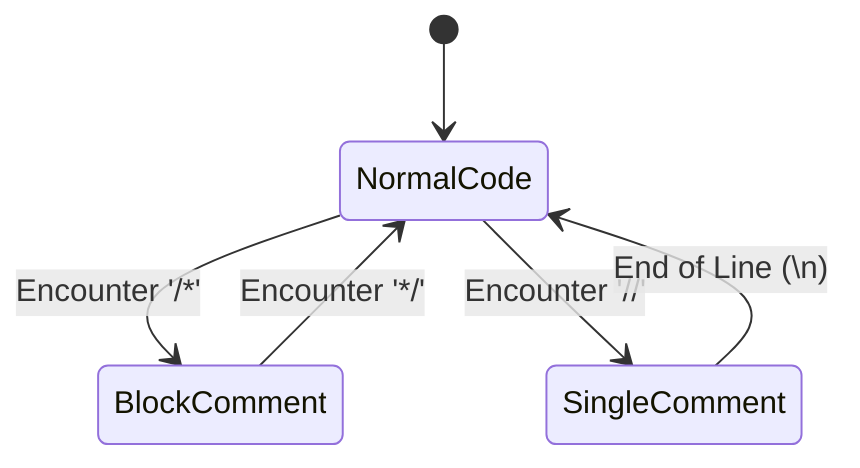

# C++ Concepts & Theory: Tracking Comment Line Numbers (A2.2)

This guide addresses how to find the **line numbers** where comments are present in source code. It builds upon `A2.1.cpp` (comment classification) and expands it to handle multi-line source input and line counting.

---

## Table of Contents
1. [The Core Problem: How to Track Line Numbers?](#1-the-core-problem-how-to-track-line-numbers)
2. [Approach 1: Single-Line Comments (//) Only](#2-approach-1-single-line-comments--only)
3. [Approach 2: Handling Both Single-Line (//) & Multi-Line (/* ... */) Comments](#3-approach-2-handling-both-single-line---multi-line----comments)
4. [Complete Multi-Line Comment Detector Implementation](#4-complete-multi-line-comment-detector-implementation)
5. [String & Stream Helper Methods Reference](#5-string--stream-helper-methods-reference)
6. [Key Takeaways Summary](#6-key-takeaways-summary)
7. [Understanding cin.ignore() (Mixing cin >> and getline)](#7-understanding-cinignore-mixing-cin--and-getline)
8. [String Array & 2D Character Grid (string text[n] and text[i][j])](#8-string-array--2d-character-grid-string-textn-and-textij)
9. [Handling Multi-Line Comments Separated by Newlines (`A2.2_multiline.cpp`)](#9-handling-multi-line-comments-separated-by-newlines-a22_multilinecpp)
   - [A. The Core Challenge with `getline()`](#a-the-core-challenge-with-getline)
   - [B. State-Machine Line-by-Line Tracking](#b-state-machine-line-by-line-tracking)
   - [C. Reading All Lines at Once via Custom Delimiter](#c-reading-all-lines-at-once-via-custom-delimiter)
   - [D. Can Delimiters be the ESC Button or '0'?](#d-can-delimiters-be-the-esc-button-or-0)

---

## 1. The Core Problem: How to Track Line Numbers?

In `A2.1.cpp`, a single string was read using `getline(cin, text)` and analyzed. However, source code consists of **multiple lines**, and comments can appear anywhere.

### Key Questions:
1. **How do we know where newlines occur?**
   - When reading standard input or a file using `getline(cin, line)`, each iteration of the loop automatically represents **one single line** of code. The newline character (`\n`) is consumed as the delimiter.
2. **How do we know which line number we are on?**
   - Maintain an explicit **line counter variable** (`int currentLine = 1;`) that increments by `1` every time `getline()` reads a new line.
3. **How do we detect where comment syntax starts on a line?**
   - Use string search functions like `line.find("//")` or `line.find("/*")` to detect comments anywhere on the line (whether standalone or after code).

---

## 2. Approach 1: Single-Line Comments (`//`) Only

If input only contains single-line comments:

### Algorithm:
1. Initialize `int lineNumber = 1`.
2. Loop with `while (getline(cin, line))`:
   - Check if `line` contains `//` using `line.find("//")`.
   - If found, output or record `lineNumber`.
   - Increment `lineNumber++`.

### C++ Code Implementation:
```cpp
#include <iostream>
#include <string>
#include <vector>

using namespace std;

int main() {
    string line;
    int lineNumber = 1;
    vector<int> commentLines;

    cout << "Enter code (press Ctrl+Z then Enter on Windows or Ctrl+D on Linux to end input):\n";

    // Reads input line-by-line until EOF
    while (getline(cin, line)) {
        // Search for "//" anywhere in the line
        size_t pos = line.find("//");
        if (pos != string::npos) {
            commentLines.push_back(lineNumber);
            cout << "Line " << lineNumber << " contains a single-line comment: " << line << "\n";
        }
        lineNumber++;
    }

    cout << "\nTotal lines with comments: " << commentLines.size() << "\n";
    cout << "Comment line numbers: ";
    for (int l : commentLines) {
        cout << l << " ";
    }
    cout << "\n";

    return 0;
}
```

---

## 3. Approach 2: Handling Both Single-Line (`//`) & Multi-Line (`/* ... */`) Comments

Multi-line comments can span across **multiple lines**. When a `/*` is opened on line 3 and closed `*/` on line 6, lines 3, 4, 5, and 6 are all comment lines.

### State Tracking using a Boolean Flag:
To track multi-line comments across lines, use a boolean flag: `bool insideBlockComment = false;`

- **If `insideBlockComment` is true**: The entire current line is part of a comment until `*/` is found.
- **When `/*` is found**: Set `insideBlockComment = true`.
- **When `*/` is found**: Set `insideBlockComment = false`.

---

## 4. Complete Multi-Line Comment Detector Implementation

```cpp
#include <iostream>
#include <string>
#include <vector>

using namespace std;

int main() {
    string line;
    int lineNumber = 1;
    bool insideBlock = false;
    vector<int> commentLines;

    cout << "Enter source code (Ctrl+Z / Ctrl+D to stop):\n";

    while (getline(cin, line)) {
        bool isCommentLine = false;

        // If we are already inside a multi-line comment block
        if (insideBlock) {
            isCommentLine = true;
            // Check if block comment ends on this line
            if (line.find("*/") != string::npos) {
                insideBlock = false;
            }
        } 
        else {
            // Check for single-line comment //
            size_t singlePos = line.find("//");
            // Check for multi-line comment start /*
            size_t blockStartPos = line.find("/*");

            if (singlePos != string::npos && (blockStartPos == string::npos || singlePos < blockStartPos)) {
                isCommentLine = true;
            } 
            else if (blockStartPos != string::npos) {
                isCommentLine = true;
                // Check if block comment finishes on the SAME line (e.g., /* comment */)
                size_t blockEndPos = line.find("*/", blockStartPos + 2);
                if (blockEndPos == string::npos) {
                    insideBlock = true; // Spans to subsequent lines
                }
            }
        }

        if (isCommentLine) {
            commentLines.push_back(lineNumber);
            cout << "[Line " << lineNumber << "] " << line << "\n";
        }

        lineNumber++;
    }

    cout << "\nSummary:\n";
    cout << "Total comment lines: " << commentLines.size() << "\n";
    cout << "Lines: ";
    for (int l : commentLines) {
        cout << l << " ";
    }
    cout << "\n";

    return 0;
}
```

---

## 5. String & Stream Helper Methods Reference

| Method / Symbol | Description | Example |
| :--- | :--- | :--- |
| `getline(cin, str)` | Reads an entire line including spaces until `\n` | `getline(cin, line)` |
| `cin.ignore()` | Discards the next character (usually leftover `\n`) from input buffer | `cin >> n; cin.ignore();` |
| `str.find("target")` | Returns position index of `target` in `str`, or `string::npos` if not found | `line.find("//")` |
| `string::npos` | Constant representing "not found" returned by `std::string::find` | `if (pos != string::npos)` |
| `lineNumber++` | Keeps track of current line number in input stream loop | Incremented at end of loop |

---

## 6. Key Takeaways Summary

1. **Newlines**: Handled naturally by using `getline()`. Each call reads up to the next `\n`.
2. **Line Numbers**: Managed with an integer counter (`lineNumber`) initialized to `1` and incremented inside the `while (getline(...))` loop.
3. **Single Line (`//`)**: Detected via `line.find("//") != string::npos`.
4. **Multi Line (`/* ... */`)**: Maintained across iterations using a boolean flag `insideBlock`.

---

## 7. Understanding `cin.ignore()` (Mixing `cin >>` and `getline`)

### The Problem: Why `getline()` skips input after `cin >> n`
When you type a number `5` and press **Enter** in the terminal:
- The input stream buffer receives: `'5'` followed by `'\n'` (newline character).
- `cin >> n` extracts `'5'` into `n`, but **leaves `'\n'` sitting in the input stream buffer**.
- Next, when `getline(cin, str)` runs, it immediately finds `'\n'` sitting at the front of the input buffer. It consumes `'\n'`, treats it as an **empty line** (`""`), and moves on without waiting for user input!

### Visualization of the Input Buffer:

```text
User types: 5 [Enter]
Buffer content:  ['5'] ['\n']
                  ^
cin >> n reads:  '5'
Buffer remains:        ['\n']   <-- Leftover newline!

Next line: getline(cin, text);
getline sees '\n' immediately and reads an EMPTY string!
```

### The Solution: `cin.ignore()`

`cin.ignore()` clears/discards the leftover newline character from the input buffer so that `getline()` can properly wait for real user input.

```cpp
int n;
cin >> n;         // Reads integer 'n', leaves '\n' in buffer
cin.ignore();     // Discards leftover '\n' character from buffer

for (int i = 0; i < n; i++) {
    string line;
    getline(cin, line); // Now correctly pauses and reads actual input line!
}
```

---

## 8. String Array & 2D Character Grid (`string text[n]` and `text[i][j]`)

### Declaring an Array of Strings
In C++, declaring `string text[n]` creates an array where **each element (index) stores an entire `std::string` object**.

```cpp
string text[n]; // Creates an array of 'n' string objects
```

### 2D Grid Representation:
Because each `std::string` is internally a dynamic array of characters (`char`), combining an array with strings forms a **2D Character Grid**:

| Index Syntax | Level | Represents | Type | Example Value |
| :--- | :--- | :--- | :--- | :--- |
| `text[i]` | 1st Dimension (Row) | The entire $i$-th line string | `std::string` | `"// Hello World"` |
| `text[i][j]` | 2nd Dimension (Column) | The $j$-th character in line $i$ | `char` | `'/'` |

### Visualizing `text[i][j]`:

```text
Dimension 1 (Line Index i)     Dimension 2 (Character Index j)
-------------------------     ----------------------------------------
text[0]  ("// Comment")   -->  [0]='/'  [1]='/'  [2]=' '  [3]='C' ...
text[1]  ("int x = 5;")   -->  [0]='i'  [1]='n'  [2]='t'  [3]=' ' ...
text[2]  ("/* Block */")  -->  [0]='/'  [1]='*'  [2]=' '  [3]='B' ...
```

### Comment Detection Example Using `text[i][0]` and `text[i][1]`:
To check if the $i$-th line starts with a single-line comment:

```cpp
if (text[i][0] == '/' && text[i][1] == '/') {
    cout << "Line " << i + 1 << " is a single-line comment!\n";
}
```

- `text[i][0]` evaluates the **first character** of the $i$-th line.
- `text[i][1]` evaluates the **second character** of the $i$-th line.

---

## 9. Handling Multi-Line Comments Separated by Newlines (`A2.2_multiline.cpp`)

### A. The Core Challenge with `getline()`
Standard `getline(cin, line)` consumes characters up to the newline character (`'\n'`). When a multi-line comment spans across multiple lines:
```c
/* Line 1 of comment
   Line 2 of comment
   Line 3 of comment */
```
Each newline causes `getline()` to return immediately with only one line of text. The string on Line 1 contains `/*`, Line 2 contains neither `/*` nor `*/`, and Line 3 contains `*/`.

### B. State-Machine Line-by-Line Tracking
To correctly classify this, we maintain a persistent state flag (`bool inside_block = false;`) across the input loop:



1. **When `/*` is found**: Set `inside_block = true`. Check if `*/` also exists on the same line. If not, `inside_block` remains `true` for future lines.
2. **On subsequent lines**: If `inside_block == true`, the line is automatically counted as a comment line. We scan for `*/`. Once found, `inside_block` resets to `false`.

### C. Reading All Lines at Once via Custom Delimiter
If you want to read multi-line input containing actual newlines directly into a single `std::string` without line-by-line prompting, pass a custom delimiter to `getline()`:

```cpp
string full_source;
// Reads across all newlines until the '$' symbol is typed
getline(cin, full_source, '$');
```

Alternatively, read until End-Of-File (EOF via `Ctrl+Z` / `Ctrl+D`):
```cpp
string full_source((istreambuf_iterator<char>(cin)), istreambuf_iterator<char>());
```

### D. Can Delimiters be the ESC Button or '0'?

#### 1. Can it be the number `'0'`?
**Yes, syntactically:**
```cpp
getline(cin, full_code, '0');
```
- **The Catch**: Any occurrence of `'0'` inside the code (such as `return 0;`, `int count = 10;`, `0.5`, or comments containing `0`) will **prematurely terminate input** right at that digit.
- **The Null Character (`'\0'`) Alternative**:
  Passing `'\0'` (ASCII 0) via `getline(cin, full_code, '\0')` is a well-known C++ technique. Since the keyboard does not normally send null bytes, `getline()` will continue reading across all newlines until the user signals **EOF** (`Ctrl+Z` on Windows or `Ctrl+D` on Linux).

#### 2. Can it be the ESC button?
**Technically yes, but practically problematic in standard consoles:**
- The ESC key has an ASCII character code: `27` in decimal, or `'\x1B'` in hex.
- Syntactically:
  ```cpp
  getline(cin, full_code, '\x1B'); // or 27
  ```
- **Why it fails in standard terminal consoles**:
  Standard OS terminals operate in **canonical (line-buffered) mode**. The OS input driver does not send typed characters to `cin` when you press `ESC`—it waits until the user presses `Enter` (`\n`).
  Furthermore, pressing `ESC` in some shells triggers terminal escape sequences rather than emitting raw `'\x1B'`.
  To detect an instantaneous `ESC` keypress without pressing `Enter`, you would need non-standard unbuffered console APIs (such as `_getch()` from `<conio.h>` on Windows or raw mode `termios` on Linux).

#### 3. Best-Practice Multi-Line Input Termination:

| Method | Syntax | Pros | Cons |
| :--- | :--- | :--- | :--- |
| **Fixed Line Count** | `for (int i = 0; i < n; i++) getline(cin, line);` | Explicit, predictable | Must know line count upfront |
| **End-Of-File (EOF)** | `while (getline(cin, line))` | Standard compiler behavior (`Ctrl+Z`/`Ctrl+D`) | Requires knowing EOF keystroke |
| **Sentinel String** | `if (line == "END" \|\| line == "EOF") break;` | Intuitive for console users | Cannot have a line literally named "END" |
| **Custom Delimiter** | `getline(cin, code, '$');` or `getline(cin, code, '~');` | Captures entire string at once | Delimiter cannot appear inside the code |


