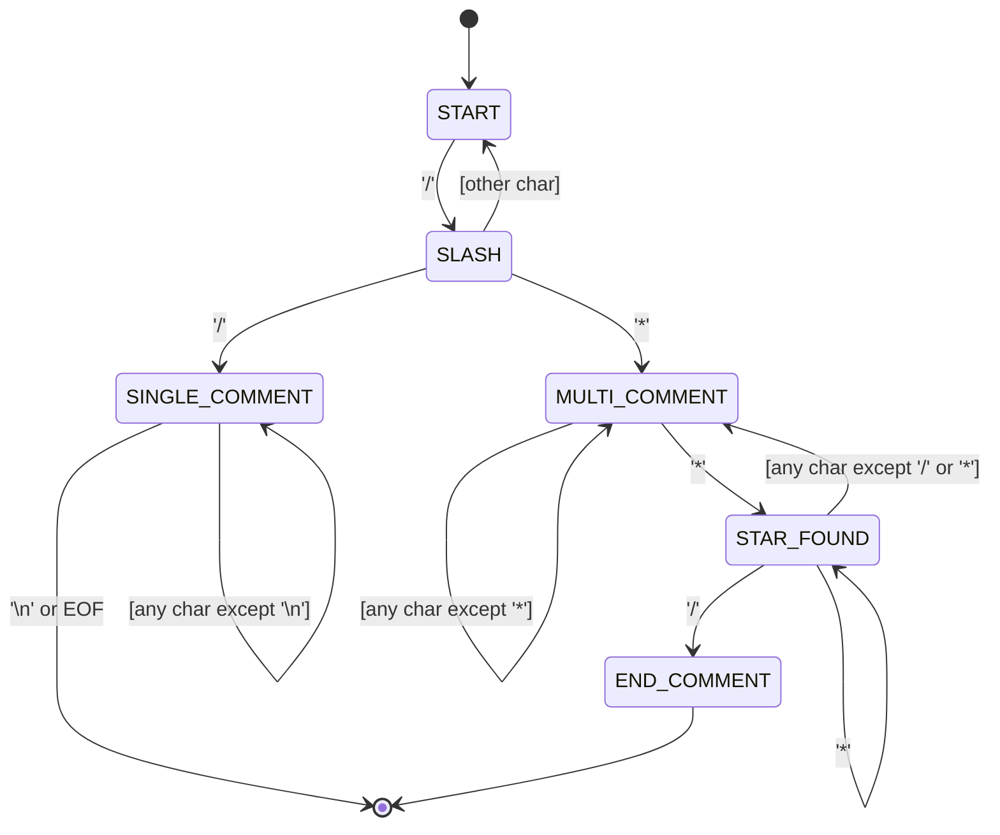
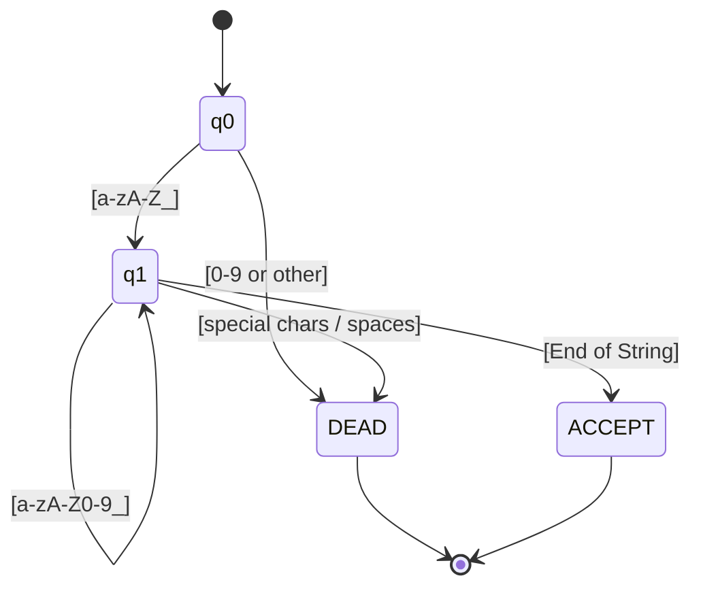
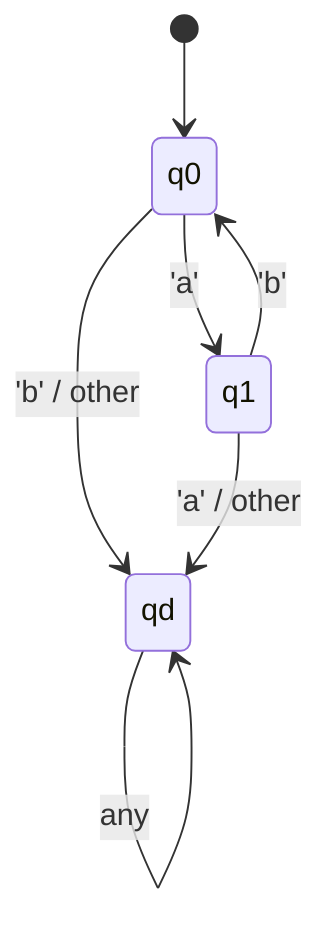
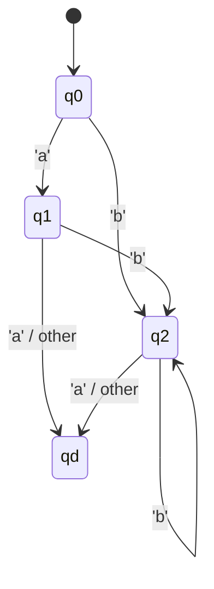

# Compiler Design & Construction Lab: Lab Test Preparation & Study Guide (`LabTestPrep.md`)

**Course**: Compiler Design & Construction Lab (`Compiler-Lab-Codes`)  
**Institution**: University of Information Technology and Sciences (UITS)  
**Academic Focus**: Practical Front-End Compilation, Automata, Lexical Analysis, Robust Stream I/O, Modular C/C++, and Custom DSL Mechanics.

---

## Table of Contents
1. [Curriculum Architecture & Lab Test Blueprint](#1-curriculum-architecture--lab-test-blueprint)
   - [1.1 Lab Test Topic Weightage](#11-lab-test-topic-weightage)
   - [1.2 Compiler Front-End Pipeline Mapping](#12-compiler-front-end-pipeline-mapping)
2. [Module 1: String I/O, Stream Handling & Memory Safety](#2-module-1-string-io-stream-handling--memory-safety)
   - [2.1 Theoretical Concepts & Stream Mechanics](#21-theoretical-concepts--stream-mechanics)
   - [2.2 Polyglot Stream Comparison Matrix (C vs C++ vs Python)](#22-polyglot-stream-comparison-matrix-c-vs-c-vs-python)
   - [2.3 Code Dissection: Lab 1.1, 1.2 & Anti-Patterns](#23-code-dissection-lab-11-12--anti-patterns)
   - [2.4 Practice Problemset 1: String Processing & Frequency Analysis](#24-practice-problemset-1-string-processing--frequency-analysis)
     - [Problem 1.1: First Non-Repeating Character Scanner](#problem-11-first-non-repeating-character-scanner)
     - [Problem 1.2: Case-Insensitive Token Frequency Profiler](#problem-12-case-insensitive-token-frequency-profiler)
     - [Problem 1.3: Anagram Token Classifier](#problem-13-anagram-token-classifier)
     - [Problem 1.4: Safe String Concatenation & Boundary Truncation](#problem-14-safe-string-concatenation--boundary-truncation)
3. [Module 2: Lexical Comment Stripping & Multi-Line Stream Parsing](#3-module-2-lexical-comment-stripping--multi-line-stream-parsing)
   - [3.1 Lexical Grammar of Comments](#31-lexical-grammar-of-comments)
   - [3.2 DFA State Machine for Comment Recognition](#32-dfa-state-machine-for-comment-recognition)
   - [3.3 Code Dissection: Lab 2.1 & Line Tracking (A2.2)](#33-code-dissection-lab-21--line-tracking-a22)
   - [3.4 Practice Problemset 2: Comment Extraction & Sanitation](#34-practice-problemset-2-comment-extraction--sanitation)
     - [Problem 2.1: Line-by-Line Comment Type Classifier](#problem-21-line-by-line-comment-type-classifier)
     - [Problem 2.2: Multi-Line Source Code Sanitizer (Comment Stripper)](#problem-22-multi-line-source-code-sanitizer-comment-stripper)
     - [Problem 2.3: Comment Line Number Tracker & Unterminated Block Detector](#problem-23-comment-line-number-tracker--unterminated-block-detector)
     - [Problem 2.4: String Literal Shielded Comment Scanner](#problem-24-string-literal-shielded-comment-scanner)
4. [Module 3: Lexical Analysis, Token Categorization & Identifier Validation](#4-module-3-lexical-analysis-token-categorization--identifier-validation)
   - [4.1 Tokens, Patterns, and Lexemes](#41-tokens-patterns-and-lexemes)
   - [4.2 Identifier Grammar & DFA Validation](#42-identifier-grammar--dfa-validation)
   - [4.3 Tokenizer Architecture: Space-Delimited vs Character-Stream Scanning](#43-tokenizer-architecture-space-delimited-vs-character-stream-scanning)
   - [4.4 Code Dissection: Lab 4.1, A3.1-A3.5 & ANKUR Lexical Analyzer](#44-code-dissection-lab-41-a31-a35--ankur-lexical-analyzer)
   - [4.5 Practice Problemset 3: Scanning & Token Processing](#45-practice-problemset-3-scanning--token-processing)
     - [Problem 3.1: Strict Identifier & Keyword Differentiator](#problem-31-strict-identifier--keyword-differentiator)
     - [Problem 3.2: Multi-Operator Continuous Scanner](#problem-32-multi-operator-continuous-scanner)
     - [Problem 3.3: Complete Expression Lexer with Symbol Frequency & Duplicate Error Detection](#problem-33-complete-expression-lexer-with-symbol-frequency--duplicate-error-detection)
     - [Problem 3.4: Numeric Literal Classifier (Integer vs Floating Point vs Hex)](#problem-34-numeric-literal-classifier-integer-vs-floating-point-vs-hex)
5. [Module 4: Formal Languages, Regular Expressions & Automata](#5-module-4-formal-languages-regular-expressions--automata)
   - [4.1 Regular Expression Operations & Formal Semantics](#41-regular-expression-operations--formal-semantics)
   - [4.2 Analysis of Lab 6.1 Patterns](#42-analysis-of-lab-61-patterns)
   - [4.3 State Transition Tables & Mermaid State Diagrams](#43-state-transition-tables--mermaid-state-diagrams)
   - [4.4 Practice Problemset 4: Automata Simulation & Acceptance](#44-practice-problemset-4-automata-simulation--acceptance)
     - [Problem 4.1: General DFA State Engine for `(ab)*`, `a?b+`, `ab+`, `a+b`](#problem-41-general-dfa-state-engine-for-ab-ab-ab-ab)
     - [Problem 4.2: Binary DFA: Strings Ending in `01` or `10`](#problem-42-binary-dfa-strings-ending-in-01-or-10)
     - [Problem 4.3: Even-Length Alternating Bit Recognizer](#problem-43-even-length-alternating-bit-recognizer)
     - [Problem 4.4: Subset Construction (NFA to DFA Conversion Exercise)](#problem-44-subset-construction-nfa-to-dfa-conversion-exercise)
6. [Module 5: Modular C++ Architecture & Robust Stream Handling](#6-module-5-modular-c-architecture--robust-stream-handling)
   - [6.1 Modular Code: Header (`.h`) vs Implementation (`.cpp`)](#61-modular-code-header-h-vs-implementation-cpp)
   - [6.2 Preprocessor Directives, Include Guards & Multiple Inclusions](#62-preprocessor-directives-include-guards--multiple-inclusions)
   - [6.3 Compiler Warnings: `-Wreturn-type` & Undefined Control Paths](#63-compiler-warnings--wreturn-type--undefined-control-paths)
   - [6.4 `std::cin` Stream Failure Recovery (`failbit`, `clear()`, `ignore()`)](#64-stdcin-stream-failure-recovery-failbit-clear-ignore)
   - [6.5 Practice Problemset 5: Modular Architecture & Stream Guards](#65-practice-problemset-5-modular-architecture--stream-guards)
     - [Problem 5.1: Modular Arithmetic Lexer Package (`calc.h` & `calc.cpp`)](#problem-51-modular-arithmetic-lexer-package-calch--calccpp)
     - [Problem 5.2: Self-Healing Console Input Reader](#problem-52-self-healing-console-input-reader)
7. [Module 6: Advanced DSL Design & Metaprogramming (`A4_b1t_Lang`)](#7-module-6-advanced-dsl-design--metaprogramming-a4_b1t_lang)
   - [7.1 Preprocessor Macro Token Expansion](#71-preprocessor-macro-token-expansion)
   - [7.2 Variadic Templates & C++17 Fold Expressions](#72-variadic-templates--c17-fold-expressions)
   - [7.3 Practice Problemset 6: DSL Constructs](#73-practice-problemset-6-dsl-constructs)
     - [Problem 6.1: Mini-DSL Keyword Aliaser](#problem-61-mini-dsl-keyword-aliaser)
     - [Problem 6.2: Variadic Math Aggregator](#problem-62-variadic-math-aggregator)
8. [Lab Test Quick-Reference & Exam Survival Cheat-Sheet](#8-lab-test-quick-reference--exam-survival-cheat-sheet)
   - [8.1 Essential ASCII & Character Inspection Tables](#81-essential-ascii--character-inspection-tables)
   - [8.2 GCC/G++ Command Line Toolkit](#82-gccg-command-line-toolkit)
   - [8.3 The Top 10 Fatal Lab Test Bugs & How to Prevent Them](#83-the-top-10-fatal-lab-test-bugs--how-to-prevent-them)

---

## 1. Curriculum Architecture & Lab Test Blueprint

### 1.1 Lab Test Topic Weightage

A standard compiler lab assessment tests your competence in four distinct areas:
1. **Raw String Manipulation & Stream Sanitation** ($\approx 25\%$): Reading with spaces, newline stripping, buffer boundaries, preventing segmentation faults.
2. **Lexical Scanning & Token Categorization** ($\approx 35\%$): Differentiating keywords, identifiers, constants, arithmetic/relational/increment operators, and delimiters.
3. **Finite Automata & Pattern Matching** ($\approx 25\%$): Transition tables, state tracking, rejecting invalid lexemes, regular expression engines.
4. **Code Quality, Memory Safety & Modular Architecture** ($\approx 15\%$): Clean function decomposition, header file conventions, avoiding undefined behavior.

### 1.2 Compiler Front-End Pipeline Mapping

```
Source Code Text (Raw Stream)
       │
       ▼
┌─────────────────────────────────────────────────────────────┐
│ 1. Stream Reading & Pre-filtering (Module 1, 2)             │
│    - Read full lines with whitespace (getline / fgets)      │
│    - Comment removal (// and /* ... */)                     │
│    - Track source line & column coordinates                 │
└─────────────────────────────────────────────────────────────┘
       │ Cleaned Character Stream
       ▼
┌─────────────────────────────────────────────────────────────┐
│ 2. Lexical Analyzer / Scanner (Module 3, 4)                 │
│    - DFA / State transitions matching lexemes               │
│    - Classify: Keyword, Identifier, Number, Operator        │
│    - Maintain Symbol Table & detect duplicate identifiers   │
└─────────────────────────────────────────────────────────────┘
       │ Token Stream [ <ID, "sum">, <ASSIGN, "=">, <NUM, "10"> ]
       ▼
┌─────────────────────────────────────────────────────────────┐
│ 3. Syntax & Semantic Analysis (Future Labs)                 │
│    - Context-Free Grammar (CFG) validation                  │
│    - Parse Trees, Abstract Syntax Trees (AST)               │
└─────────────────────────────────────────────────────────────┘
```

---

## 2. Module 1: String I/O, Stream Handling & Memory Safety

### 2.1 Theoretical Concepts & Stream Mechanics

In compiler lexical analysis, the source file arrives as an unstructured stream of bytes. To process tokens accurately, scanners must ingest lines **without truncating whitespace**.

#### Whitespace Truncation Pitfall
* **`scanf("%s", buf)`** (C) and **`cin >> str`** (C++) are designed for single-word extraction. They automatically skip leading whitespace (spaces, tabs, newlines) and terminate immediately upon reaching the next whitespace.
* If the input is `/* calculate total */`, `cin >> text` extracts only `"/*"`. The trailing `*/` is left in the stream buffer, causing subsequent logic relying on `text.back()` or `text[len-1]` to fail completely.

#### Correct Alternatives
* **C++**: `getline(cin, text)` reads every character until the next newline `\n`.
* **C**: `fgets(buf, sizeof(buf), stdin)` reads until newline or buffer capacity, safely avoiding buffer overflow. Note that `fgets` keeps the trailing `\n` in the buffer, which must be stripped:
  ```c
  buf[strcspn(buf, "\r\n")] = '\0';
  ```
* **Python**: `sys.stdin.readline()` or `input()` consumes whole lines directly.

---

### 2.2 Polyglot Stream Comparison Matrix (C vs C++ vs Python)

| Feature / Operation | C (`<stdio.h>`, `<string.h>`) | C++ (`<iostream>`, `<string>`) | Python 3 |
| :--- | :--- | :--- | :--- |
| **Read line with spaces** | `fgets(buf, max_size, stdin)` | `getline(cin, str)` | `sys.stdin.readline()` / `input()` |
| **Line-ending strip** | `buf[strcspn(buf, "\r\n")] = '\0'` | Handled by `getline()`; `\n` discarded | `str.rstrip("\r\n")` |
| **Character access safety**| Manual: check index $< strlen(buf)$ | `str.at(i)` (bounds checked) vs `str[i]` | `s[i]` with `IndexError` guard |
| **Find substring / prefix** | `strncmp(s, "int", 3) == 0` | `str.rfind("int", 0) == 0` / `str.starts_with()` | `str.startswith("int")` |
| **Buffer overflow risk** | Extreme if using `gets()` or `strcpy()` | Low (managed dynamic heap memory) | Zero (automatic memory management) |
| **Character inspection** | `<ctype.h>` (`isalpha`, `isdigit`) | `<cctype>` (`std::isalpha`, etc.) | `char.isalpha()`, `char.isdigit()` |

---

### 2.3 Code Dissection: Lab 1.1, 1.2 & Anti-Patterns

#### Anti-Pattern 1: Illegal Zero-Sized Array (`Lab_Codes/1.2.cpp`)
```cpp
// ❌ CRITICAL BUG: Zero-length array is illegal in standard C++
char rep[0];
rep[0] = text[i]; // Memory corruption / undefined behavior!
```
* **Why it fails**: Declaring an array of size 0 (`char rep[0]`) yields undefined behavior in ISO C++. Writing to `rep[0]` performs an out-of-bounds write that corrupts the stack frame.
* **Fix**: Use a standard scalar character `char rep = text[i];` or dynamic container.

#### Anti-Pattern 2: Flawed Inner Search Bound (`Lab_Codes/1.2.cpp`)
```cpp
// ❌ WRONG: Truncates search space and ignores preceding characters
for(int j = 1; j < tsize - i; j++)
```
* **Why it fails**: Checking whether `text[i]` is unique requires checking **all** characters $j \ne i$ across the full length $[0, tsize - 1]$, not just a shrinking forward window.
* **Premature Break Error**: The code in `1.2.cpp` printed a character the instant it encountered a single mismatch with an adjacent character, rather than verifying zero repetitions across the entire string.

---

### 2.4 Practice Problemset 1: String Processing & Frequency Analysis

#### Problem 1.1: First Non-Repeating Character Scanner
* **Problem Statement**: Given a stream of tokens or a variable identifier string $S$, find the first non-repeating character in $S$. If all characters repeat, output `$` to indicate no unique symbol exists.
* **Input**: A single string $S$ ($1 \le |S| \le 10^5$) containing ASCII characters.
* **Output**: The first non-repeating character, or `$`.
* **Example**:
  * Input: `compiler_compiler` $\rightarrow$ Output: `_`
  * Input: `aabbcc` $\rightarrow$ Output: `$`

##### Core Logic & Algorithmic Proof:
Two-pass frequency counting:
1. Pass 1: Build an ASCII frequency array `int freq[256] = {0}`. Increment `freq[(unsigned char)c]++` for each character in $S$. Time: $\mathcal{O}(N)$.
2. Pass 2: Iterate through $S$ linearly. The first character $c$ whose `freq[(unsigned char)c] == 1` is the global first unique character. Return immediately. Time: $\mathcal{O}(N)$.
3. Total Time: $\mathcal{O}(N)$, Space: $\mathcal{O}(1)$ auxiliary (256 integers).

##### Complete Solution (C++):
```cpp
#include <iostream>
#include <string>
#include <vector>

using namespace std;

char findFirstUnique(const string &s) {
    vector<int> freq(256, 0);
    for (unsigned char c : s) {
        freq[c]++;
    }
    for (unsigned char c : s) {
        if (freq[c] == 1) {
            return c;
        }
    }
    return '$';
}

int main() {
    string input;
    if (getline(cin, input)) {
        cout << findFirstUnique(input) << "\n";
    }
    return 0;
}
```

---

#### Problem 1.2: Case-Insensitive Token Frequency Profiler
* **Problem Statement**: Read a full line of source code containing variable names separated by arbitrary spaces. Output each unique identifier (case-insensitive) along with its occurrence count, sorted alphabetically.
* **Input**: `Sum = sum + SUM - total`
* **Output**:
  ```text
  sum: 3
  total: 1
  ```
* **Core Logic**:
  1. Tokenize line into alphanumeric lexemes.
  2. Normalize each token to lowercase using `tolower()`.
  3. Store counts in `std::map<string, int>` which inherently maintains alphabetical order.

##### Complete Solution (C++):
```cpp
#include <iostream>
#include <string>
#include <sstream>
#include <map>
#include <cctype>

using namespace std;

string toLowerStr(const string &str) {
    string res = "";
    for (char c : str) res += tolower((unsigned char)c);
    return res;
}

int main() {
    string line;
    if (!getline(cin, line)) return 0;

    map<string, int> freq;
    string current = "";

    for (size_t i = 0; i <= line.size(); ++i) {
        if (i < line.size() && isalnum((unsigned char)line[i])) {
            current.push_back(line[i]);
        } else {
            if (!current.empty()) {
                freq[toLowerStr(current)]++;
                current.clear();
            }
        }
    }

    for (const auto &[word, count] : freq) {
        cout << word << ": " << count << "\n";
    }
    return 0;
}
```

---

#### Problem 1.3: Anagram Token Classifier
* **Problem Statement**: Given a list of tokens, group identifiers that are anagrams of each other (i.e. identical character multisets, which often happen in obfuscated code).
* **Input**: `cat act tac dog god rat`
* **Output**:
  ```text
  [act, cat, tac]
  [dog, god]
  [rat]
  ```
* **Core Logic**:
  Sort each token's characters as the canonical key (`sort(key.begin(), key.end())`). Group tokens into `std::unordered_map<string, vector<string>>`.

---

#### Problem 1.4: Safe String Concatenation & Boundary Truncation
* **Problem Statement**: In C, implement a custom safe string concatenation function `safe_strcat(char *dest, const char *src, size_t max_dest_size)` that guarantees null-termination without buffer overflow.
* **Core Logic**:
  1. Find existing length of `dest`: `size_t cur = strlen(dest)`.
  2. If `cur >= max_dest_size - 1`, return immediately.
  3. Copy characters from `src` until `max_dest_size - 1`.
  4. Explicitly append `dest[written] = '\0'`.

---

## 3. Module 2: Lexical Comment Stripping & Multi-Line Stream Parsing

### 3.1 Lexical Grammar of Comments

In languages following the C standard:
* **Single-Line Comment**: Begins with `//` and extends to the end of the current physical line (`\n` or `EOF`).
  $$\text{Comment}_{\text{single}} \longrightarrow // (\Sigma - \{\backslash n\})^*$$
* **Multi-Line Comment**: Begins with `/*` and terminates at the first occurrence of `*/`. Can span multiple physical lines.
  $$\text{Comment}_{\text{multi}} \longrightarrow /* (\Sigma^* - (\Sigma^* */ \Sigma^*)) */$$

---

### 3.2 DFA State Machine for Comment Recognition

The following Finite State Automaton represents the exact scanner mechanics required to distinguish division operators `/`, single-line comments `//`, and multi-line comments `/* ... */`.



#### DFA State Transition Matrix

| Current State | Input `/` | Input `*` | Input `\n` | Other Characters |
| :--- | :--- | :--- | :--- | :--- |
| **`START`** | `SLASH` | `START` | `START` | `START` |
| **`SLASH`** | `SINGLE_COMMENT` | `MULTI_COMMENT` | `START` | `START` |
| **`SINGLE_COMMENT`** | `SINGLE_COMMENT` | `SINGLE_COMMENT` | `START` (Reset) | `SINGLE_COMMENT` |
| **`MULTI_COMMENT`** | `MULTI_COMMENT` | `STAR_FOUND` | `MULTI_COMMENT` | `MULTI_COMMENT` |
| **`STAR_FOUND`** | `START` (Comment closed) | `STAR_FOUND` | `MULTI_COMMENT` | `MULTI_COMMENT` |

---

### 3.3 Code Dissection: Lab 2.1 & Line Tracking (A2.2)

#### Lab 2.1 Review (`Lab_Codes/2.1.cpp`)
```cpp
if (text[0] == '/' && text[1] == '/') {
    cout << text << " is a Single Line Comment" << endl;
}
else if (text[0] == '/' && text[1] == '*' && 
         text[text.size() - 2] == '*' && text[text.size() - 1] == '/') {
    cout << text << " is a Multiple Line Comment" << endl;
}
```
* **Critical Flaw 1**: Assumes the comment occupies the entire line. It cannot classify trailing comments on code lines (e.g. `int a = 5; // comment`).
* **Critical Flaw 2**: Buffer underflow crash occurs if `text.size() < 2`. Accessing `text[text.size() - 2]` when `text.size() == 1` invokes undefined behavior (negative index memory access).

---

### 3.4 Practice Problemset 2: Comment Extraction & Sanitation

#### Problem 2.1: Line-by-Line Comment Type Classifier
* **Problem Statement**: Given $N$ lines of text, categorize each line as:
  1. `SINGLE LINE COMMENT` (starts with `//`)
  2. `MULTI LINE COMMENT` (starts with `/*` and ends with `*/` on the same line)
  3. `NOT A COMMENT`
* **Boundary Conditions**: Must strictly verify `length >= 2` before `text[1]` and `length >= 4` before `text[length-2]`.

##### Complete Solution (C++):
```cpp
#include <iostream>
#include <string>

using namespace std;

void classifyCommentLine(const string &s) {
    size_t len = s.size();
    if (len >= 2 && s[0] == '/' && s[1] == '/') {
        cout << "SINGLE LINE COMMENT\n";
    } else if (len >= 4 && s[0] == '/' && s[1] == '*' && s[len - 2] == '*' && s[len - 1] == '/') {
        cout << "MULTI LINE COMMENT\n";
    } else {
        cout << "NOT A COMMENT\n";
    }
}

int main() {
    string line;
    while (getline(cin, line)) {
        classifyCommentLine(line);
    }
    return 0;
}
```

---

#### Problem 2.2: Multi-Line Source Code Sanitizer (Comment Stripper)
* **Problem Statement**: Implement the preprocessor phase of a compiler. Read a full multi-line program and strip out all single-line and multi-line comments. Output clean code preserving line structure.
* **Input**:
  ```c
  /* Program Header */
  int x = 10; // assign ten
  /* multi-line
     note */
  printf("%d", x);
  ```
* **Output**:
  ```c
  int x = 10; 

  printf("%d", x);
  ```

##### Core Logic & State Tracking:
Maintain a boolean state `bool in_block_comment = false`.
Iterate character by character across each line:
1. If not in comment:
   - Check if `s[i] == '/' && s[i+1] == '/'`: ignore rest of the line (`break`).
   - Check if `s[i] == '/' && s[i+1] == '*'`: set `in_block_comment = true`, skip both characters (`i++`).
   - Otherwise, append `s[i]` to sanitized line buffer.
2. If in comment:
   - Check if `s[i] == '*' && s[i+1] == '/'`: set `in_block_comment = false`, skip both characters (`i++`).

##### Complete Solution (C++):
```cpp
#include <iostream>
#include <string>

using namespace std;

int main() {
    string line;
    bool in_block_comment = false;

    while (getline(cin, line)) {
        string clean_line = "";
        for (size_t i = 0; i < line.size(); ++i) {
            if (!in_block_comment) {
                if (i + 1 < line.size() && line[i] == '/' && line[i + 1] == '/') {
                    break; // Skip rest of line
                } else if (i + 1 < line.size() && line[i] == '/' && line[i + 1] == '*') {
                    in_block_comment = true;
                    i++; // Skip '*'
                } else {
                    clean_line.push_back(line[i]);
                }
            } else {
                if (i + 1 < line.size() && line[i] == '*' && line[i + 1] == '/') {
                    in_block_comment = false;
                    i++; // Skip '/'
                }
            }
        }
        // Output clean line if it is not purely empty whitespace residue
        if (!clean_line.empty() || !in_block_comment) {
            cout << clean_line << "\n";
        }
    }
    return 0;
}
```

---

#### Problem 2.3: Comment Line Number Tracker & Unterminated Block Detector
* **Problem Statement**: Process code lines and print the 1-based line number of every line containing a comment. If a multi-line comment opens with `/*` but the file reaches `EOF` without finding a closing `*/`, print `ERROR: Unterminated comment starting at line X`.

##### Complete Solution (C++):
```cpp
#include <iostream>
#include <string>
#include <vector>

using namespace std;

int main() {
    string line;
    int line_num = 0;
    int comment_start_line = -1;
    bool in_comment = false;
    vector<int> commented_lines;

    while (getline(cin, line)) {
        line_num++;
        bool has_comment = false;

        for (size_t i = 0; i < line.size(); ++i) {
            if (!in_comment) {
                if (i + 1 < line.size() && line[i] == '/' && line[i + 1] == '/') {
                    has_comment = true;
                    break;
                } else if (i + 1 < line.size() && line[i] == '/' && line[i + 1] == '*') {
                    in_comment = true;
                    has_comment = true;
                    comment_start_line = line_num;
                    i++;
                }
            } else {
                has_comment = true;
                if (i + 1 < line.size() && line[i] == '*' && line[i + 1] == '/') {
                    in_comment = false;
                    i++;
                }
            }
        }

        if (has_comment) {
            commented_lines.push_back(line_num);
        }
    }

    if (in_comment) {
        cout << "ERROR: Unterminated comment starting at line " << comment_start_line << "\n";
    } else {
        cout << "Comments present on lines: ";
        for (int l : commented_lines) cout << l << " ";
        cout << "\n";
    }
    return 0;
}
```

---

## 4. Module 3: Lexical Analysis, Token Categorization & Identifier Validation

### 4.1 Tokens, Patterns, and Lexemes

| Concept | Formal Definition | Example in `int count = 10;` |
| :--- | :--- | :--- |
| **Token** | Abstract classification symbol used by parsers | `<KEYWORD>`, `<ID>`, `<ASSIGN>`, `<INT_CONST>`, `<SEMICOLON>` |
| **Lexeme** | The concrete source code characters matching a token pattern | `"int"`, `"count"`, `"="`, `"10"`, `";"` |
| **Pattern** | The formal specification (regex) generating valid lexemes | `[a-zA-Z_][a-zA-Z0-9_]*` for identifiers |

---

### 4.2 Identifier Grammar & DFA Validation

#### Formal Grammar Production:
$$\text{Identifier} \longrightarrow (\text{Letter} \mid \text{`\_`}) (\text{Letter} \mid \text{Digit} \mid \text{`\_`})^*$$
$$\text{Where Letter} \in [a\text{-}z, A\text{-}Z], \quad \text{Digit} \in [0\text{-}9]$$

#### Identifier DFA State Transition:


#### Lexical Rule: Keywords Overrule Identifiers
An identifier cannot match any reserved keyword in the language lookup table:
`{"int", "float", "double", "char", "if", "else", "while", "for", "return", "void"}`.

---

### 4.3 Tokenizer Architecture: Space-Delimited vs Character-Stream Scanning

#### The Space-Delimited Flaw (`Lab_Codes/4.1.cpp`)
In `Lab_Codes/4.1.cpp`, token extraction is performed using:
```cpp
if (text[i] == ' ') { ... }
```
* **Failure Condition**: Real code does not require whitespace around operators: `x=a+b*2;` or `val++;`.
* `4.1.cpp` lumps `x=a+b*2;` into a single string token, failing all operator checks and printing the entire arithmetic expression as an identifier!

#### The Robust Solution: Character-by-Character Scanning
Inspect character classes in a loop with an index $i$:
1. If `isspace(c)`: advance $i$.
2. If `isalpha(c) || c == '_'`: consume all contiguous `isalnum(c) || c == '_'`. Check against keyword dictionary; otherwise it is an Identifier.
3. If `isdigit(c)`: consume all contiguous digits. Classify as Numeric Constant.
4. If punctuation or operator symbol:
   - Check multi-character operators first (`++`, `--`, `==`, `!=`, `<=`, `>=`).
   - If not matched, check single-character operators (`+`, `-`, `*`, `/`, `=`).
5. Delimiters (`;`, `,`, `(`, `)`, `{`, `}`).

---

### 4.4 Code Dissection: Lab 4.1, A3.1-A3.5 & ANKUR Lexical Analyzer

In `ANKUR_lexical analysis_16-8-26.c`, the user required:
> *"ekhane expression e identifier,operator,numeric value koyta ache seta count kore code dao. jegula repeat korbe segula print hobe na. ekta error msg asbe jodi same identifier ekadhik bar hoi"*

This requires:
1. Extracting discrete identifiers, operators, and numeric constants.
2. Deduplicating items in the printed list (unique sets).
3. Maintaining a frequency map for identifiers. If any identifier frequency $> 1$, emit:
   `Error: Duplicate identifier '<name>' detected!`.

---

### 4.5 Practice Problemset 3: Scanning & Token Processing

#### Problem 3.1: Strict Identifier & Keyword Differentiator
* **Problem Statement**: Write a function `classifyWord(string s)` that determines whether $s$ is a `KEYWORD`, a `VALID IDENTIFIER`, or an `INVALID IDENTIFIER`.
* **Test Cases**:
  * `_score1` $\rightarrow$ `VALID IDENTIFIER`
  * `3rd_var` $\rightarrow$ `INVALID IDENTIFIER` (Starts with digit)
  * `while` $\rightarrow$ `KEYWORD`
  * `my-var` $\rightarrow$ `INVALID IDENTIFIER` (Hyphen illegal)

##### Complete Solution (C++):
```cpp
#include <iostream>
#include <string>
#include <unordered_set>
#include <cctype>

using namespace std;

const unordered_set<string> KEYWORDS = {
    "auto", "break", "case", "char", "const", "continue", "default", "do",
    "double", "else", "enum", "extern", "float", "for", "goto", "if",
    "int", "long", "register", "return", "short", "signed", "sizeof", "static",
    "struct", "switch", "typedef", "union", "unsigned", "void", "volatile", "while"
};

string classifyWord(const string &s) {
    if (s.empty()) return "INVALID IDENTIFIER";
    
    if (KEYWORDS.find(s) != KEYWORDS.end()) {
        return "KEYWORD";
    }

    // Must start with letter or underscore
    if (!isalpha((unsigned char)s[0]) && s[0] != '_') {
        return "INVALID IDENTIFIER";
    }

    // Remaining characters must be alphanumeric or underscore
    for (size_t i = 1; i < s.size(); ++i) {
        if (!isalnum((unsigned char)s[i]) && s[i] != '_') {
            return "INVALID IDENTIFIER";
        }
    }

    return "VALID IDENTIFIER";
}

int main() {
    string word;
    while (cin >> word) {
        cout << word << ": " << classifyWord(word) << "\n";
    }
    return 0;
}
```

---

#### Problem 3.2: Multi-Operator Continuous Scanner
* **Problem Statement**: Given an unspaced expression (e.g. `x=a++-b*c>=10;`), tokenize and print every operator in the exact order encountered, distinguishing compound operators (`++`, `--`, `>=`) from single operators (`+`, `-`, `=`).

##### Core Logic:
Greedy prefix matching. At character $i$, look ahead to $i+1$. Check if `s.substr(i, 2)` belongs to the two-char operator set before testing single character `s[i]`.

##### Complete Solution (C++):
```cpp
#include <iostream>
#include <string>
#include <vector>
#include <unordered_set>

using namespace std;

const unordered_set<string> COMPOUND_OPS = {"++", "--", "==", "!=", "<=", ">=", "+=", "-=", "*=", "/="};
const unordered_set<char> SINGLE_OPS = {'+', '-', '*', '/', '=', '<', '>', '!'};

int main() {
    string expr;
    if (!getline(cin, expr)) return 0;

    vector<string> operators;
    size_t i = 0;
    while (i < expr.size()) {
        if (i + 1 < expr.size()) {
            string two_char = expr.substr(i, 2);
            if (COMPOUND_OPS.count(two_char)) {
                operators.push_back(two_char);
                i += 2;
                continue;
            }
        }
        if (SINGLE_OPS.count(expr[i])) {
            operators.push_back(string(1, expr[i]));
            i++;
            continue;
        }
        i++;
    }

    cout << "Detected Operators:\n";
    for (const string &op : operators) {
        cout << op << " ";
    }
    cout << "\n";
    return 0;
}
```

---

#### Problem 3.3: Complete Expression Lexer with Symbol Frequency & Duplicate Error Detection
* **Problem Statement** (Based on `ANKUR_lexical analysis_16-8-26.c`):
  Scan an arithmetic assignment string (e.g. `sum = a + b * a - 5;`).
  1. Print unique identifiers.
  2. Print unique operators.
  3. Print numeric values.
  4. Print counts for each category.
  5. Print an error diagnostic listing any identifier that appeared more than once.

##### Complete Solution (C++):
```cpp
#include <iostream>
#include <string>
#include <vector>
#include <set>
#include <map>
#include <cctype>

using namespace std;

int main() {
    string s;
    cout << "Enter expression: ";
    if (!getline(cin, s)) return 0;

    map<string, int> id_freq;
    vector<string> id_order;
    set<string> seen_id;

    set<string> unique_operators;
    vector<string> numeric_values;

    size_t i = 0;
    while (i < s.size()) {
        if (isspace((unsigned char)s[i])) {
            i++;
            continue;
        }

        // 1. Identifiers: starts with letter or underscore
        if (isalpha((unsigned char)s[i]) || s[i] == '_') {
            string id = "";
            while (i < s.size() && (isalnum((unsigned char)s[i]) || s[i] == '_')) {
                id.push_back(s[i++]);
            }
            id_freq[id]++;
            if (!seen_id.count(id)) {
                seen_id.insert(id);
                id_order.push_back(id);
            }
            continue;
        }

        // 2. Numeric constants
        if (isdigit((unsigned char)s[i])) {
            string num = "";
            while (i < s.size() && isdigit((unsigned char)s[i])) {
                num.push_back(s[i++]);
            }
            numeric_values.push_back(num);
            continue;
        }

        // 3. Operators (check compound first)
        if (i + 1 < s.size()) {
            string two = s.substr(i, 2);
            if (two == "++" || two == "--" || two == "==" || two == "!=" || two == "<=" || two == ">=") {
                unique_operators.insert(two);
                i += 2;
                continue;
            }
        }
        if (s[i] == '=' || s[i] == '+' || s[i] == '-' || s[i] == '*' || s[i] == '/' || s[i] == '<' || s[i] == '>') {
            unique_operators.insert(string(1, s[i]));
            i++;
            continue;
        }

        // 4. Skip delimiters
        i++;
    }

    cout << "\nIdentifiers: ";
    for (const string &id : id_order) cout << id << " ";
    cout << "\nTotal Identifiers Count: " << seen_id.size() << "\n";

    cout << "\nOperators: ";
    for (const string &op : unique_operators) cout << op << " ";
    cout << "\nTotal Operators Count: " << unique_operators.size() << "\n";

    cout << "\nNumeric Values: ";
    for (const string &num : numeric_values) cout << num << " ";
    cout << "\nTotal Numeric Count: " << numeric_values.size() << "\n";

    // Diagnostic check for duplicate identifiers
    bool duplicate_found = false;
    for (const auto &[id, count] : id_freq) {
        if (count > 1) {
            if (!duplicate_found) {
                cout << "\n[SEMANTIC WARNING / ERROR]\n";
                duplicate_found = true;
            }
            cout << "Identifier '" << id << "' repeated " << count << " times!\n";
        }
    }

    return 0;
}
```

---

## 5. Module 4: Formal Languages, Regular Expressions & Automata

### 4.1 Regular Expression Operations & Formal Semantics

In compiler construction, lexemes are defined via regular expressions over an alphabet $\Sigma$:
1. **$\epsilon$ (Empty String)**: String of length 0.
2. **Concatenation ($ab$)**: Character $a$ followed immediately by character $b$.
3. **Alternation ($a \mid b$)**: Character $a$ OR character $b$.
4. **Kleene Closure ($a^*$)**: Zero or more occurrences of $a$ ($\{\epsilon, a, aa, aaa, \dots\}$).
5. **Positive Closure ($a^+$)**: One or more occurrences of $a$ ($aa^* = \{a, aa, aaa, \dots\}$).
6. **Optional ($a?$)**: Zero or one occurrence of $a$ ($\{\epsilon, a\}$).

---

### 4.2 Analysis of Lab 6.1 Patterns

`Lab_Codes/6.1.cpp` investigates 4 distinct regular patterns:

#### Pattern 1: `(ab)*`
* **Language $L$**: Strings formed by alternating pairs of $ab$: $\{\epsilon, ab, abab, ababab, \dots\}$.
* **Accepted Strings**: `""`, `"ab"`, `"abab"`, `"ababab"`.
* **Rejected Strings**: `"a"`, `"b"`, `"aba"`, `"abb"`, `"ba"`.

#### Pattern 2: `a?b+`
* **Language $L$**: An optional single $a$, followed by one or more $b$'s.
* **Accepted Strings**: `"b"`, `"bb"`, `"bbb"`, `"ab"`, `"abb"`, `"abbb"`.
* **Rejected Strings**: `""`, `"a"`, `"aab"`, `"ba"`, `"aba"`.

#### Pattern 3: `ab+`
* **Language $L$**: Exactly one $a$, followed by one or more $b$'s.
* **Accepted Strings**: `"ab"`, `"abb"`, `"abbb"`, `"abbbb"`.
* **Rejected Strings**: `""`, `"a"`, `"b"`, `"bb"`, `"aab"`, `"aba"`.

#### Pattern 4: `a+b`
* **Language $L$**: One or more $a$'s, followed by exactly one $b$.
* **Accepted Strings**: `"ab"`, `"aab"`, `"aaab"`, `"aaaab"`.
* **Rejected Strings**: `""`, `"a"`, `"b"`, `"abb"`, `"ba"`, `"aaba"`.

---

### 4.3 State Transition Tables & Mermaid State Diagrams

#### DFA for `(ab)*`
* States: $q_0$ (Initial & Accepting), $q_1$ (Saw `a`), $q_d$ (Dead/Rejecting).



| State | Input `'a'` | Input `'b'` | Accepting? |
| :--- | :--- | :--- | :--- |
| **`q0`** | `q1` | `qd` | **YES** ($\epsilon$) |
| **`q1`** | `qd` | `q0` | NO |
| **`qd`** | `qd` | `qd` | NO (Trap) |

---

#### DFA for `a?b+`
* States: $q_0$ (Start), $q_1$ (Saw `a`), $q_2$ (Accepting on `b`), $q_d$ (Trap).



| State | Input `'a'` | Input `'b'` | Accepting? |
| :--- | :--- | :--- | :--- |
| **`q0`** | `q1` | `q2` | NO |
| **`q1`** | `qd` | `q2` | NO |
| **`q2`** | `qd` | `q2` | **YES** |
| **`qd`** | `qd` | `qd` | NO |

---

### 4.4 Practice Problemset 4: Automata Simulation & Acceptance

#### Problem 4.1: General DFA State Engine for `(ab)*`, `a?b+`, `ab+`, `a+b`
* **Problem Statement**: Implement an automated test harness that reads an input string and indicates which of the four patterns (`(ab)*`, `a?b+`, `ab+`, `a+b`) accept it.

##### Complete Solution (C++):
```cpp
#include <iostream>
#include <string>

using namespace std;

bool match_ab_star(const string &s) {
    // (ab)*
    if (s.size() % 2 != 0) return false;
    for (size_t i = 0; i < s.size(); i += 2) {
        if (s[i] != 'a' || s[i + 1] != 'b') return false;
    }
    return true;
}

bool match_a_opt_b_plus(const string &s) {
    // a?b+
    if (s.empty()) return false;
    size_t i = 0;
    if (s[0] == 'a') i++;
    if (i >= s.size() || s[i] != 'b') return false;
    while (i < s.size() && s[i] == 'b') i++;
    return i == s.size();
}

bool match_ab_plus(const string &s) {
    // ab+
    if (s.size() < 2 || s[0] != 'a') return false;
    for (size_t i = 1; i < s.size(); ++i) {
        if (s[i] != 'b') return false;
    }
    return true;
}

bool match_a_plus_b(const string &s) {
    // a+b
    if (s.size() < 2 || s.back() != 'b') return false;
    for (size_t i = 0; i < s.size() - 1; ++i) {
        if (s[i] != 'a') return false;
    }
    return true;
}

int main() {
    string input;
    while (cin >> input) {
        cout << "Testing: \"" << input << "\"\n";
        if (match_ab_star(input)) cout << "  -> Matches (ab)*\n";
        if (match_a_opt_b_plus(input)) cout << "  -> Matches a?b+\n";
        if (match_ab_plus(input)) cout << "  -> Matches ab+\n";
        if (match_a_plus_b(input)) cout << "  -> Matches a+b\n";
    }
    return 0;
}
```

---

#### Problem 4.2: Binary DFA: Strings Ending in `01` or `10`
* **Problem Statement**: Construct a state machine accepting binary strings over $\{0, 1\}$ that terminate in either `01` or `10`.
* **State Mapping**:
  * $q_0$: Empty / saw non-discriminating prefix
  * $q_{0\_last}$: Last character seen was `0`
  * $q_{1\_last}$: Last character seen was `1`
  * $q_{accept\_01}$: Just transitioned via $q_{0\_last} \xrightarrow{1} q_{accept\_01}$ (Accepting)
  * $q_{accept\_10}$: Just transitioned via $q_{1\_last} \xrightarrow{0} q_{accept\_10}$ (Accepting)

---

## 6. Module 5: Modular C++ Architecture & Robust Stream Handling

### 6.1 Modular Code: Header (`.h`) vs Implementation (`.cpp`)

In compiler development, parsers, scanners, and symbol tables are partitioned into separate files to maintain clean encapsulation and avoid massive monolithic codebases.

* **Header File (`lexer.h`)**:
  - Contains function prototypes, struct/class declarations, and constant definitions.
  - Acts as the public interface contract.
* **Source File (`lexer.cpp`)**:
  - Implements the logic declared in the header.
* **Driver File (`main.cpp`)**:
  - Includes `lexer.h` via `#include "lexer.h"` and orchestrates compiler execution.

---

### 6.2 Preprocessor Directives, Include Guards & Multiple Inclusions

When multiple files include the same header, declarations can be repeated, triggering compiler error:
`redefinition of 'struct Token'` or `redefinition of 'int sum(int, int)'`.

#### Header Guards (Standard ISO C++):
```cpp
#ifndef LEXER_H
#define LEXER_H

// Declarations here

#endif // LEXER_H
```

#### Modern Alternative:
```cpp
#pragma once // Supported by GCC, Clang, MSVC
```

---

### 6.3 Compiler Warnings: `-Wreturn-type` & Undefined Control Paths

#### The Bug from Lab 5 (`Lab_Codes/5.Header_File/new.h`)
```cpp
float divi(float a, float b) {
    if (b == 0) {
        cout << "Division of 0 --> Invalid" << endl;
        // Missing return!
    }
    return a / b;
}
```
* **Compiler Diagnostic**: `warning: control reaches end of non-void function [-Wreturn-type]`
* **Danger**: If `b == 0`, execution logs an error, falls out of the `if` block, executes `return a / b` (dividing by zero anyway!), or exits without returning a defined floating point value, producing garbage.
* **The Fix**:
  ```cpp
  float divi(float a, float b) {
      if (b == 0) {
          cerr << "Division by zero error!\n";
          return 0.0f; // Return explicit safe fallback
      }
      return a / b;
  }
  ```

---

### 6.4 `std::cin` Stream Failure Recovery (`failbit`, `clear()`, `ignore()`)

When a user or automated grader passes unexpected characters (e.g. typing `"abc"` when expecting an integer `cin >> n`):
1. `std::cin` enters a failure state and sets `failbit`.
2. All subsequent `cin >>` extractions fail silently, leaving variables uninitialized.
3. If inside a `while (cin >> n)` loop that does not reset the state, an **infinite loop** occurs!

#### Recovery Recipe:
```cpp
if (cin.fail()) {
    cin.clear(); // 1. Reset error flags (failbit)
    cin.ignore(numeric_limits<streamsize>::max(), '\n'); // 2. Flush corrupted input
}
```

---

### 6.5 Practice Problemset 5: Modular Architecture & Stream Guards

#### Problem 5.1: Modular Arithmetic Lexer Package (`calc.h` & `calc.cpp`)
* **Objective**: Create a modular C++ library containing safe arithmetic functions (`add`, `subtract`, `multiply`, `divide`, `modulo`) with full header guards and zero-divisor guards.

##### File 1: `calc.h`
```cpp
#pragma once

int add(int a, int b);
int subtract(int a, int b);
long long multiply(int a, int b);
double divide(double a, double b, bool &error);
int modulo(int a, int b, bool &error);
```

##### File 2: `calc.cpp`
```cpp
#include "calc.h"

int add(int a, int b) { return a + b; }
int subtract(int a, int b) { return a - b; }
long long multiply(int a, int b) { return 1LL * a * b; }

double divide(double a, double b, bool &error) {
    if (b == 0.0) {
        error = true;
        return 0.0;
    }
    error = false;
    return a / b;
}

int modulo(int a, int b, bool &error) {
    if (b == 0) {
        error = true;
        return 0;
    }
    error = false;
    return a % b;
}
```

---

#### Problem 5.2: Self-Healing Console Input Reader
* **Problem Statement**: Write a function `int getValidatedInt(const string &prompt)` that repeatedly prompts the user until a valid integer is entered, handling invalid alphanumeric garbage safely without entering infinite loops.

##### Complete Solution (C++):
```cpp
#include <iostream>
#include <string>
#include <limits>

using namespace std;

int getValidatedInt(const string &prompt) {
    int value;
    while (true) {
        cout << prompt;
        if (cin >> value) {
            return value;
        }
        cout << "Invalid numeric input! Please enter a valid integer.\n";
        cin.clear();
        cin.ignore(numeric_limits<streamsize>::max(), '\n');
    }
}

int main() {
    int n = getValidatedInt("Enter token count: ");
    cout << "Successfully received: " << n << "\n";
    return 0;
}
```

---

## 7. Module 6: Advanced DSL Design & Metaprogramming (`A4_b1t_Lang`)

### 7.1 Preprocessor Macro Token Expansion

In Assignment 4 (`A4_b1t_Lang`), the compiler student created a custom Domain-Specific Language (DSL) via C++ macro substitutions:
* Redefining entry point: `#define main int main()`
* Fast I/O detachment:
  ```cpp
  #define detach_C() ios_base::sync_with_stdio(false); cin.tie(NULL)
  ```
* Stream aliases:
  ```cpp
  inline auto &in = std::cin;
  inline auto &out = std::cout;
  ```
* Custom loop constructs:
  ```cpp
  #define loop(var, start, end, step) for (int var = start; var < end; step)
  ```

---

### 7.2 Variadic Templates & C++17 Fold Expressions

In standard C++, functions take a fixed count of parameters. In `A4_b1t_Lang`, variadic fold expressions allow expressions of arbitrary length:
```cpp
template<typename... Args>
auto sum(Args... args) {
    return (args + ...); // Unary right fold: (a + (b + (c + d)))
}
```

---

### 7.3 Practice Problemset 6: DSL Constructs

#### Problem 6.1: Mini-DSL Keyword Aliaser
* **Problem Statement**: Implement a header `minilang.h` using preprocessor directives to allow the following code to compile and run:
  ```cpp
  #include "minilang.h"
  begin_prog
      variable(x, 10);
      variable(y, 20);
      print("Sum is: ");
      println(x + y);
  end_prog
  ```

##### Solution (`minilang.h`):
```cpp
#pragma once
#include <iostream>

#define begin_prog int main() {
#define end_prog return 0; }
#define variable(name, val) auto name = val
#define print(val) std::cout << val
#define println(val) std::cout << val << "\n"
```

---

## 8. Lab Test Quick-Reference & Exam Survival Cheat-Sheet

### 8.1 Essential ASCII & Character Inspection Tables

| Range | Characters | Hex Range | `<cctype>` Predicate |
| :--- | :--- | :--- | :--- |
| `48` – `57` | `'0'` – `'9'` | `0x30` – `0x39` | `isdigit(c)` |
| `65` – `90` | `'A'` – `'Z'` | `0x41` – `0x5A` | `isupper(c)`, `isalpha(c)` |
| `97` – `122` | `'a'` – `'z'` | `0x61` – `0x7A` | `islower(c)`, `isalpha(c)` |
| `95` | `'_'` (Underscore) | `0x5F` | Valid Identifier starter |
| `32`, `9`, `10` | `' '`, `'\t'`, `'\n'` | Whitespace | `isspace(c)` |

---

### 8.2 GCC/G++ Command Line Toolkit

Save these commands for the lab terminal:

```bash
# 1. Compile C++ with standard C++20 and all warnings
g++ -Wall -Wextra -std=c++20 Lab_Codes/<file>.cpp -o Lab_Codes/<binary_name>

# 2. Compile C with C17 standard
gcc -Wall -Wextra -std=c17 Lab_Codes/<file>.c -o Lab_Codes/<binary_name>

# 3. Multi-file compilation (Modular Header + Implementation)
g++ -Wall -Wextra -std=c++20 Lab_Codes/5.Header_File/new.cpp -o Lab_Codes/5.Header_File/new

# 4. Running the compiled binary
./Lab_Codes/<binary_name>
```

---

### 8.3 The Top 10 Fatal Lab Test Bugs & How to Prevent Them

1. **Using `cin >> str` for sentences/comments**:
   - *Failure*: Stops at first whitespace.
   - *Fix*: Always use `getline(cin, str)`.
2. **Buffer underflow on string indexing**:
   - *Failure*: `text[text.size() - 2]` crashes if `text.size() < 2`.
   - *Fix*: Guard with `if (text.size() >= 2)` first.
3. **Misclassifying single character operators**:
   - *Failure*: Matching `+` before `++` consumes the first `+` and leaves a stray `+`.
   - *Fix*: Always test longer compound tokens (`++`, `--`, `<=`, `==`) before single-character tokens (`+`, `-`, `<`, `=`).
4. **Treating keywords as identifiers**:
   - *Failure*: `if`, `while`, `int` validate as identifiers under `[a-zA-Z_][a-zA-Z0-9_]*`.
   - *Fix*: Check word against a `set<string> KEYWORDS` before finalizing token as identifier.
5. **Neglecting trailing newline in C `fgets`**:
   - *Failure*: `strlen(buf)` includes `'\n'`, breaking exact string comparisons like `strcmp(buf, "exit")`.
   - *Fix*: `buf[strcspn(buf, "\r\n")] = '\0'`.
6. **Zero-sized arrays (`char rep[0]`)**:
   - *Failure*: Causes stack corruption and undefined memory write.
   - *Fix*: Use scalar variables or `std::vector`.
7. **Missing return in non-void function**:
   - *Failure*: Returning nothing from an `if (error)` path yields garbage.
   - *Fix*: Every branch in a non-void function must explicitly `return`.
8. **Infinite loop on invalid console input**:
   - *Failure*: `cin >> n` fails on text, leaves character in buffer, loops forever.
   - *Fix*: `cin.clear(); cin.ignore(10000, '\n');`.
9. **Missing header guards**:
   - *Failure*: Re-definition errors when multiple files `#include "header.h"`.
   - *Fix*: Add `#pragma once` at the very top of every `.h` file.
10. **Off-by-one errors in token substrings**:
    - *Failure*: `str.substr(pos, length)` takes `(start_index, length)`, NOT `(start_index, end_index)`.
    - *Fix*: Calculate length as `end - start`.
